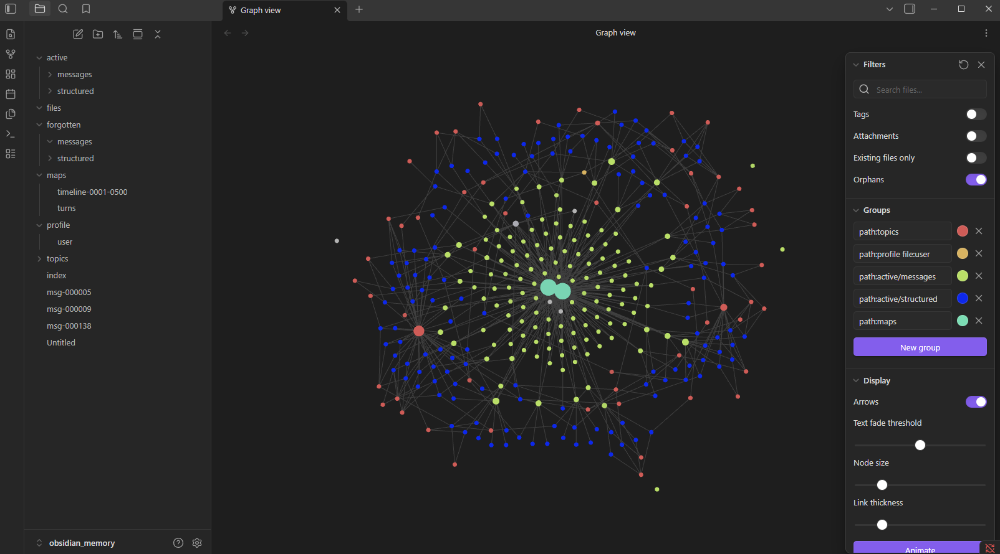

# RagMemory

RagMemory gives Codex a local memory that survives across turns.

It stores your conversation locally, recalls useful context before a new prompt,
and keeps a generated Obsidian mirror so you can inspect what was remembered.



## What It Does

- Remembers useful chat context across Codex sessions.
- Recalls relevant memory automatically through Codex hooks.
- Saves assistant replies after each turn.
- Extracts durable structured memory such as decisions, preferences, configs,
  code references, and open questions.
- Exports a readable Obsidian vault under `.data/obsidian_memory`.
- Uses decay-aware retrieval so stale memories naturally appear less often.
- Supports manual tombstone removal for wrong, private, or harmful memory.

Raw memory is not deleted during normal forgetting. Forgetting means old,
unused memories rank lower during retrieval.

## Recommended Setup

From the repo root:

```powershell
uv venv
uv pip install -e .
```

Create your local settings file:

```powershell
Copy-Item .\ragmemory.example.ini .\ragmemory.local.ini
```

Edit `ragmemory.local.ini` and add your API key:

```ini
[structured_memory]
api_key = your-nvidia-api-key
model = minimaxai/minimax-m2.7

[compact]
enable = true
model = minimaxai/minimax-m2.7
min_chars = 1500
max_chars = 30000
target_ratio = 0.35
mode = background
```

`ragmemory.local.ini` is ignored by git. Do not commit it.

## Use With Codex Hooks

Install the Codex hooks from:

```text
ragm_mcp/hooks/README.md
```

After the hooks are installed:

- `UserPromptSubmit` recalls memory and injects it into Codex.
- `UserPromptSubmit` saves your user prompt.
- `Stop` saves the assistant response.
- `Stop` refreshes the Obsidian mirror.
- Long-running structured extraction and compaction jobs are handled by the
  manual worker: `uv run python scripts/run_worker.py`.

On Windows you can also start the worker by double-clicking:

```text
start_worker.bat
```

Keep the worker running while chatting. Stop it before a large manual
`compact_backfill.py` run if you want to avoid duplicate API calls or NVIDIA
rate limits.

You should see injected context like this at the start of a turn:

```text
=== RagMemory Context ===
...
=== End RagMemory Context ===
```

If this context takes too many tokens, tune the hook recall size in
`ragmemory.local.ini`:

```ini
[recall]
context_token_budget = 900
retrieve_top_k = 3
structured_top_k = 2
recent_messages = 4
include_recent = true
include_structured = true
```

## MCP Tools

MCP is optional when hooks are installed.

Recommended local MCP settings:

```ini
[mcp.tools]
enable_recall = false
enable_save = false
enable_tombstone = true
```

With this split:

- Hooks own automatic recall and save.
- MCP recall is disabled to avoid duplicate token usage.
- MCP save is disabled to avoid duplicate writes.
- MCP remains useful for `memory_stats`, `remove_memory_preview`, and
  `remove_memory_confirm`.

See the MCP details in:

```text
ragm_mcp/README.md
```

## Check What Was Remembered

Inspect recent events:

```powershell
uv run python scripts/inspect_events.py --db-path ./.data/chroma_db --limit 20
```

Inspect structured-object add events:

```powershell
uv run python scripts/inspect_events.py --event structured_object_added
```

Check that the Obsidian graph export stays clean:

```powershell
uv run python scripts/check_obsidian_graph.py
```

If the graph shows isolated message dots, hide raw message notes that have no
structured links with this Obsidian graph filter:

```text
-["cssclasses":"memory-unlinked"]
```

File/path hubs are disabled by default because they can clutter the graph. Turn
them on only if you want file-level nodes:

```ini
[obsidian.files]
enable = true
```

Export the Obsidian mirror manually:

```powershell
uv run python scripts/export_obsidian.py --db-path ./.data/chroma_db --output ./.data/obsidian_memory
```

Open this folder in Obsidian:

```text
.data/obsidian_memory
```

Compacted messages may contain evidence references like:

```text
evidence[text:874b3468c9f7]
```

These are deterministic pointers to exact structured evidence blocks. In the
Obsidian mirror, message notes include an `Evidence References` section that
links each marker to the matching structured note. Structured notes also expose
`content_hash` and `evidence_ref` in frontmatter so the hash is searchable.

## Remove Bad Memory

Use removal only for memory that is wrong, private, harmful, or should not be
used again.

Preview recent records:

```powershell
uv run python scripts/remove_memory.py --recent 20
```

Search for a bad record:

```powershell
uv run python scripts/remove_memory.py --search "wrong remembered detail"
```

Preview specific message IDs:

```powershell
uv run python scripts/remove_memory.py --message-ids 12,13
```

Confirm tombstone removal:

```powershell
uv run python scripts/remove_memory.py --message-ids 12,13 --confirm
```

This is tombstone-only. It hides records from retrieval and moves them to
`forgotten/` in the Obsidian mirror. It does not hard-delete raw storage.

## Backup

Back up the active DB folder:

```powershell
Copy-Item -Recurse .\.data\chroma_db .\.data\backup-chroma_db
```

The DB folder contains:

```text
state.sqlite
chroma.sqlite3
structured_memory.jsonl
ledger.json
events.jsonl
```

## Message Compaction

Raw messages stay as the source of truth. Compaction writes a smaller
`compact_text` beside the raw message in SQLite:

```text
messages.text          raw audit log
messages.compact_text  compact retrieval/export text
messages.compact_status ok | failed | skipped_short | too_long
```

Retrieval and Obsidian prefer `compact_text` only when
`compact_status = ok`; otherwise they fall back to raw text.

Run the worker for new messages:

```powershell
uv run python scripts/run_worker.py
```

Backfill old messages manually:

```powershell
uv run python scripts/compact_backfill.py --limit 20
```

If NVIDIA returns `429 Too Many Requests`, wait a minute and retry with a
smaller limit. Stop the worker during large backfills to reduce overlap.

After changing compaction behavior, rebuild the retrieval index:

```powershell
uv run python scripts/rebuild_memory_index.py
```

## Technical Details

The implementation details, architecture, scripts, and tests live in:

```text
docs/technical.md
```
